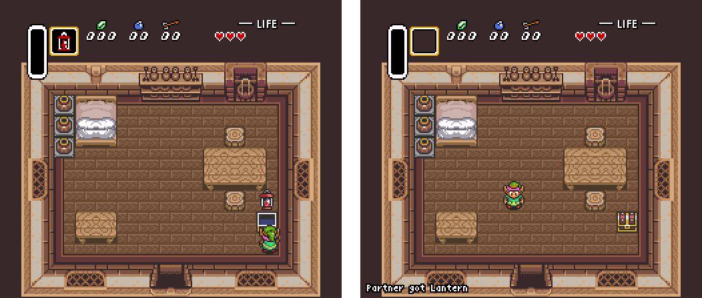

# emu-coop

This is an emulator hack that turns 1-player games into 2-player games by sharing in-game inventory over the internet.

It currently works with Legend of Zelda: A Link to the Past; the [Link to the Past Randomizer](http://vt.alttp.run/randomizer); Super Metroid; and Legend of Zelda for the NES (plus its randomizer). It works well for any game that has locks and keys and backtracking.

## Downloading

In order to run emu-coop, you will need an emulator that can run Lua scripts, such as snes9x-rr or FCEUX. (BizHawk does not work but could in a later version). If you already have an emulator, you can just download:

* TODO

If you **don't** have one, here is a copy of snes9x-rr with the coop script bundled in:

* TODO

The above are for Windows. If you are on Mac or Linux, you can get it working by dropping built copies of LuaSocket and IUP into the folder with the Lua files. I will try to get a Mac version uploaded soon.

## Running

Once you have the scripts and emulator, open snes9x-rr and the ROM you wish to play. Then select `File->Lua Scripting->New Lua Script Window`. Click "Browse" and select "coop.lua" inside the emu-coop directory.

Emu-coop communicates using Internet Relay Chat. You will get a popup asking which IRC server you want to connect to, what nickname you want to use, and what the nickname of your Player 2 will be. Once you're connected, tell your Player 2 to connect to the same network and enter your nick in their emulator. You should see either "Connected to partner", or an error message, pop up on your game screen.

If you halt a game in the middle and have to restart-- say, maybe your emulator crashed, or your Internet disconnected, or you died in Super Metroid-- you might "desync", where there are items that one player has but not the other. If this happens, both players should save, close their emulators, connect again, and this time check "Yes" for "Are you reconnecting after a crash?". This will resend all the data that emu-coop is tracking.

If you run into any problems, please feel free to [file an issue on the GitHub page](https://github.com/mcclure/emu-coop/issues) for this project.

## Modding

You can add support for additional games-- or new modes for games emu-coop already supports-- by creating a .lua file and putting it into emu-coop's "modes" directory. If you add a new mode file, you will also need to add its name to the file `modes/index.lua`.

**WARNING: Lua files are PROGRAMS, like a .exe file. A Lua file you install could give you a virus or delete files from your computer. Do not install a mode file unless it came from someone you know and trust.** 

Sorry, there is no documentation for creating a mode file yet.

## Game Support

Some more about the games currently supported:

* **Link to the Past**: Currently it syncs all collectable items, all pendants, all crystals, and in the Randomizer it tracks whether the old man has been rescued. It does not track "quantities" (rupees, heart pieces, arrows or bombs or expansions of either), or "events" like whether you have beaten Aghanim or paid off Kiki. When it updates your shield or armor, the sprite will not update until the next Save+Quit even though you have it.

* **Super Metroid**: Currently it tracks all items, beams, expansions, and whether you have beaten the four main bosses. Items you collect might not appear in the top icon bar, and when it updates your beams and armor the sprite won't update even though you have it until you change rooms or pause. This has not been tested as well as LTTP. 

* **Legend of Zelda NES**: This comes in three modes. One syncs items only, one syncs items plus dungeon completion (maps compasses triforce), and one syncs what seems to be all the memory the author could get her hands on, including things like door status.

## Authors

This was made by [Andi McClure](mailto:andi.m.mcclure@gmail.com). You can find some "normal" video games I made [here](http://runhello.com). The Zelda 1 modes were contributed by [MegMacAttack](https://twitter.com/megmacstreams).

Big thanks to:
* The LTTP Randomizer team, esp. Mike Trethewey, Zarby89 and Karkat, for information
* [Alex Zandra](https://twitter.com/zandravandra) and [Maya Shinohara](https://twitter.com/MothBooty) for help testing

## Future

I think there's a LOT you could do with this basic concept, and there's some changes I'd still like to make. Make sure to watch back here for updates.

Some ideas I think are cool:

* Item erasure: If you pick up an item in LTTP or Super Metroid, it should disappear in the other person's game. This would prevent double-collection of missile expansion in Super Metroid, or make it easier to integrate rupee and heart collection in LTTP (instead of syncing rupee count exactly, you could sync collection of the 50/100/300 rupee items etc). 
* Deltas: Right now, emu-coop syncs only numbers that only go up. Something that can go up and down, like rupee or arrow count, is hard to sync because there could be a "race" where one player sends a lower number at the same time the other sends a higher one. A good (and easy, I just didn't get to it) fix for this would be to send deltas where it sends just "I got 50 more rupees". This would mean an actual shared wallet in LTTP, and would fix a problem in Super Metroid where if both players collect a missile expansion at once it just gets lost.
* Forced coop: The LTTP randomizer discord was excited about the idea of generating two matched randomizer ROMs where each player has half the items and you have to cooperate to win.
* Cross-game coop?: Another suggestion I've heard, although this would require modding the coop scripts and possibly the games a *lot*, is coop between two different games. For example you could play LTTP and Super Metroid and have some of the items Link needs be located on Zebes, or run Zero Mission and Metroid Fusion at the same time and sync "analogous" items.

There's also some known bugs/limitations:

* If you try to run emu-coop twice without closing and reopening SNES9x, it crashes? I don't know why. I think it's because luasocket gets loaded twice.
* Mac and Linux versions?
* No BSNES/LSNES/BizHawk support
* Crashes, and dying in Super Metroid, are not handled very well.
* The IRC communication pipe could be better. It can't batch things together, it's at risk of triggering IRC flood protection, there's nothing stopping lines from getting cut off if they're too long.
* IRC communication currently uses Penlight Pretty to deserialize. [Is this secure?!](https://github.com/mcclure/emu-coop/blob/stable/pl/pretty.lua#L69)

If you have your own ideas, feel free to modify the code and send back a pull request on GitHub. The github page for emu-coop is [here](https://github.com/mcclure/emu-coop) and the github page for the snes9x build is [here](https://github.com/mcclure/snes9x-coop).

## IRC?

The default IRC network used by emu-coop is SpeedRunsLive. I went with SRL because Sluip there said it was okay. If you run an IRC network, and you want to ban emu-coop users from using your server, you can spot them because their usernames will end in "-bot" and their "real name"s will end in "(snes bot)".
